# Phase 0 — Cadrage du comparateur « Survivatoor »

> Statut : proposition, en attente de validation (« OK phase suivante »).
> Les points juridiques ci-dessous sont une analyse d'ingénierie. **Faites valider la matrice légale (§3) par un avocat en droit des armes et de la consommation avant la mise en production.**

---

## 1. Reformulation du besoin

Survivatoor est un **comparateur de prix, sans aucune fonction de vente**, pour le marché français de la survie, du bushcraft, de l'outdoor tactique, de l'armurerie légale **et de l'équipement pour animaux** (chiens de chasse et de travail, animaux en autonomie et en bivouac).

| Fait | Ne fait pas |
|---|---|
| Ingère les catalogues des marchands (flux affiliés, Google Shopping, API, scraping sous contrat) | Encaisser, vendre, stocker des commandes |
| Rapproche les offres en fiches produit canoniques | Vérifier l'âge ou les pièces justificatives (c'est le rôle du marchand) |
| Affiche le prix total (TTC + port), l'historique et les alertes | Indexer une arme de catégorie A |
| Redirige vers le marchand (`/go/{offerId}`) et mesure les sorties | Présumer qu'un produit est légal : dans le doute, il part en modération |
| Se rémunère par CPA, CPC, placements « Annonce » et fiches premium | Mélanger la monétisation du rayon armes avec celle des régies qui l'interdisent |

**Trois contraintes structurantes :**
1. **Fail-closed légal.** Toute ligne de flux passe par un moteur de règles (`LegalRule`) paramétrable. Le verdict vaut `ACCEPT`, `REJECT` (catégorie A) ou `MODERATE`, et l'absence de certitude vaut `MODERATE`.
2. **Le rapprochement est le cœur du produit.** La qualité du comparateur dépend du taux de fiches correctement fusionnées.
3. **SEO à grande échelle et contenu soumis à une porte d'âge.** Ces deux objectifs sont en tension (cache, indexation). Ils sont arbitrés au §6.

---

### 1 bis. Rayon 7 : Animaux (ajouté après le cadrage initial)

**Positionnement :** on ne se bat pas contre les animaleries généralistes (Zooplus, Amazon) sur les croquettes premier prix. Le rayon reste **cohérent avec l'univers du site** : chiens de chasse, chiens de travail, autonomie et bivouac avec un animal.

| Sous-rayon | Exemples | Attributs filtrables | Prix par unité |
|---|---|---|---|
| Chiens de chasse et de travail | Colliers GPS / repérage, gilets de protection anti-sanglier, sonnailles, laisses et longes, caisses de transport | Portée GPS (km), autonomie (h), taille (tour de cou/poitrail en cm), poids (g), protection (Kevlar, Cordura) | — |
| Alimentation et stockage | Croquettes haute énergie, pâtées, alimentation lyophilisée, conteneurs hermétiques | Espèce, âge, taux de protéines (%), kcal/kg, DLUO (mois), poids du sac | **€/kg** et €/1 000 kcal |
| Soins et premiers secours (hors médicaments, v1) | Trousses de secours canines, bandes cohésives, bottines, couvertures de survie animales | Contenu (nb de pièces), taille | — |
| Bivouac avec l'animal | Gamelles pliables, tapis isolants, sacs de couchage, harnais de portage, filtres à eau | Poids, dimensions, capacité (L) | €/L (eau) |
| Chevaux et bâtés (option) | Sacoches de bât, licols, couvertures | Taille, charge max. (kg) | — |

**Synergies :** le prix par unité (€/kg) est utile pour l'alimentation. Les chasseurs du rayon armes sont aussi propriétaires de chiens de chasse, donc les ventes croisées sont naturelles. Côté monétisation, le rayon n'est pas soumis aux restrictions des régies : **Google Shopping et les réseaux d'affiliation y sont a priori ouverts** (à confirmer programme par programme).

## 2. Hypothèses de travail (à confirmer ou corriger)

| # | Hypothèse | Impact si fausse |
|---|---|---|
| H1 | Marché **France uniquement**, EUR, prix TTC, interface FR seulement (le code reste i18n-ready) | Multi-devise et TVA par pays |
| H2 | Volumétrie à 12 mois : ~50 marchands, ~300 k offres, ~80 k fiches, ~1 M clics/mois | Dimensionnement Meilisearch/PG, partitionnement |
| H3 | Fréquence d'import : 1 à 4 fois par jour et par flux ; les plus gros flux font < 200 Mo | Streaming parser, timeouts |
| H4 | **Symfony 7.4 LTS** (la LTS de la branche 7.x, supportée jusqu'en 2029) sur PHP 8.3 | — |
| H5 | Hébergement UE (RGPD) ; un VPS unique suffit jusqu'à H2, Clever Cloud possible ensuite | Phase 11 |
| H6 | Un seul site et un seul domaine ; le rayon armes n'est pas sur un sous-domaine séparé (à rediscuter, cf. Q9) | Monétisation, régies |
| H7 | Les avis portent **uniquement sur les marchands** (pas sur les produits) et sont déposés par des comptes connectés | DSA, D111-16 et suivants |
| H8 | Le 2FA admin se fait en TOTP (scheb/2fa-totp), sans SMS | — |
| H9 | Les images restent chez le marchand (hotlink) ; LiipImagine met en cache et convertit localement en WebP/AVIF, le stockage se fait sur disque puis S3-compatible | Coûts de stockage, droits sur les images |
| H10 | Le fichier des vendeurs d'armes n'a pas d'API publique : `isLicensedDealer` est validé **manuellement**, sur justificatif (agrément, extrait Kbis) avec une date d'expiration, et l'offre est suspendue automatiquement à l'expiration | Processus admin |

---

## 3. Cadre légal : points de vigilance détectés

Conformément à la consigne, voici les **conflits ou risques** que j'ai relevés, avec une proposition conforme pour chacun. Tous sont codés en règles paramétrables (`LegalRule`) et ne sont jamais figés en dur.

| # | Point | Risque | Proposition |
|---|---|---|---|
| L1 | **Les couteaux et armes blanches sont des armes de catégorie D.** Leur vente aux mineurs est interdite, même si l'achat est libre pour un majeur. | Le brief ne met la porte d'âge qu'à l'entrée des rayons « armes, munitions, défense », alors que le rayon Survie contient des couteaux. | La règle marque `legalRequirement = MAJOR` sur les couteaux et haches de combat. Un bandeau signale la vente interdite aux mineurs et rappelle le port et le transport. **Pas de porte d'âge** sur le rayon bushcraft (pour le SEO), mais c'est configurable par catégorie → **Q7**. |
| L2 | **Vente à distance des catégories B et C (et de leurs munitions)** : la livraison passe en principe par un armurier, et l'acheteur doit présenter ses justificatifs. | Afficher « livraison à domicile » serait trompeur. | Pour les offres B/C, le bandeau indique « Retrait/livraison selon les modalités légales du vendeur (généralement chez un armurier) ». Le libellé est un contenu CMS modifiable par l'admin. |
| L3 | **Munitions** : leur catégorie suit celle de l'arme, et l'acheteur doit présenter un justificatif (permis de chasser, licence, autorisation). | Classement erroné d'une munition. | Attribut `caliber` et table de correspondance calibre → catégorie, maintenue en admin. Un calibre inconnu part en `MODERATE`. |
| L4 | **Air comprimé et airsoft** : les seuils d'énergie en joules déterminent la catégorie (< 2 J pour une réplique, 2 à 20 J pour la D, ≥ 20 J pour la C) et les restrictions pour les mineurs. | Un flux sans énergie renseignée. | Règle sur `energy_joules`. Si la valeur est **absente**, l'offre part en `MODERATE` (jamais `ACCEPT` par défaut). Les seuils sont des paramètres, pas des constantes. |
| L5 | **Publicité en faveur des armes** : elle est encadrée en France, ce qui pourrait concerner les placements sponsorisés sur les armes B/C. | Un placement « Annonce » sur une carabine pourrait être requalifié. | Par défaut, les `SponsoredPlacement` sont **désactivés** sur les produits `weaponCategory ∈ {B, C}` (flag admin). À valider par un juriste → **Q8**. |
| L6 | **« Top baisses de prix » et « prix le plus bas constaté »** (directive Omnibus, pratiques commerciales trompeuses) | Présenter comme une « promotion » une variation mesurée par nous. | Libellé « Baisse constatée par Survivatoor », avec la référence = prix le plus bas des 30 jours précédents, définie publiquement sur la page Critères de classement. Pas de mot « promo ». |
| L7 | **Avis en ligne** (art. L111-7-2 et D111-16 à D111-19 du Code de la consommation) et **DSA** (mécanisme de signalement) | Des avis non modérés de façon transparente. | Page « Comment nous modérons les avis », date de l'expérience, motif de refus notifié, bouton « Signaler », délai de conservation. |
| L8 | **Scraping** : outre robots.txt, le droit *sui generis* du producteur de base de données s'applique (art. L342-1 du CPI). | Contentieux avec un marchand. | Un `Feed` de type `SCRAPER` ne peut être activé que si un document « accord écrit » est attaché et non expiré (contrainte en base et dans le code). |
| L9 | **Cookies d'affiliation** : le réseau pose ses propres cookies au moment de la redirection. | La CNIL considère que le traçage d'affiliation n'est pas « strictement nécessaire ». | Notre `ClickOut` est journalisé **côté serveur, sans cookie**, avec une IP hachée et un sel rotatif quotidien, sur la base de l'intérêt légitime (facturation CPC). Les paramètres de sous-tracking du réseau (sub-id) ne sont ajoutés qu'avec le consentement « mesure d'audience / affiliation » → **Q10**. |
| L10 | **Vision nocturne et thermique** : la détention est libre, mais certains usages à la chasse sont interdits, et certains modèles relèvent du double usage à l'export. | Faible pour un comparateur. | Bandeau informatif configurable sur la catégorie. Aucun blocage. |
| L11 | **La porte d'âge est déclarative.** | Ce n'est pas une vérification d'âge légale (et ce n'est pas notre rôle). | Le texte de la porte le dit explicitement : « la vérification est effectuée par le vendeur ». Contenu B/C en `noindex` tant que `seoValidatedAt` est nul. |
| L12 | **Animaux vivants.** La vente en ligne de chiens et de chats est fortement encadrée depuis la loi du 30 novembre 2021 contre la maltraitance animale. | Un flux contenant des animaux vivants (chiots, appelants vivants, furets…). | Règle `REJECT` : **aucun animal vivant n'est indexé**, quelle que soit l'espèce. Mots-clés et catégories marchand détectés à l'import, puis envoi en modération. |
| L13 | **Médicaments vétérinaires** : leur vente en ligne est réservée à certains professionnels (pharmacies, vétérinaires), et les produits sur ordonnance sont exclus. | Afficher un médicament vendu par un marchand non habilité ou soumis à prescription. | **Décision : exclus de la v1.** Règle `REJECT` à l'import sur les médicaments vétérinaires (mots-clés, catégorie marchand, code AMM dans le flux). Les **antiparasitaires biocides** (colliers, sprays sans AMM) sont ambigus : ils partent en `MODERATE`. Une réouverture en v2 passerait par un flag `veterinaryAuthorized` sur `Merchant`, pas prévu dans le modèle v1. |
| L14 | **Pièges et produits de destruction des nuisibles** : l'usage de nombreux pièges est réservé aux piégeurs agréés, et certains rodenticides sont réservés aux professionnels. | Présenter un piège ou un biocide comme en libre usage. | **Décision : exclus de la v1.** Règle `REJECT` à l'import (pièges, cages-pièges, collets, rodenticides, taupicides). Aucun sous-rayon créé. |
| L15 | **Colliers de dressage** : colliers électriques, anti-aboiement. Leur statut évolue en France et en Europe, et ils sont interdits dans plusieurs pays voisins. | Réglementation susceptible de changer rapidement. | `LegalRule` dédiée, paramétrable (`ACCEPT` avec bandeau, ou `REJECT`), sans changement de code. Colliers **GPS et de repérage** sans électrostimulation : non concernés. |
| L16 | **Alimentation animale** : étiquetage réglementé (composition, constituants analytiques, DLUO). | Des allégations santé trompeuses dans les titres des flux. | Les descriptions reprises du flux sont affichées comme « Description du vendeur ». Nous ne formulons aucune allégation de santé nous-mêmes. |

---

## 4. Choix techniques justifiés (avec l'alternative écartée)

| Sujet | Choix | Pourquoi | Écarté |
|---|---|---|---|
| Architecture | **Monolithe modulaire** par contexte métier (`Catalog`, `Ingestion`, `Matching`, `Compliance`…) | Une seule base de code et un seul déploiement, avec des frontières nettes et des modules extractibles plus tard | Microservices : coût d'exploitation disproportionné pour une équipe réduite |
| Couches | `Domain` / `Application` / `Infrastructure` / `UI` dans chaque module, avec les entités Doctrine en attributs dans `Domain` | Le SOLID et la testabilité sans le formalisme d'un hexagonal « pur » (pas de double mapping) | Hexagonal strict avec mapping XML : trop verbeux pour le gain obtenu |
| Identifiants | **UUID v7** (symfony/uid) pour les entités exposées | Non énumérables (`/go/{offerId}`), triables dans le temps, fusion de fiches sans collision | Clé auto-incrémentée : énumération des offres et des clics |
| Montants | Entier en **centimes** + value object `Money` | Pas d'erreur de flottant, et le calcul du prix total est testable | `float` ou `decimal` string : erreurs d'arrondi et comparaisons fragiles |
| Arbre des catégories | **Materialized path** (`path` = `/survie/couteaux/`) + `parent_id` + `depth` | Lecture du sous-arbre par `LIKE 'path%'` indexé, URL SEO directe, écritures rares | Nested set (Gedmo) : réécritures massives à chaque déplacement, verrous. `ltree` : dépendance à une extension PG et moins bien pris en charge par Doctrine |
| Prix par unité | Quantité **déclarée sur le produit** (`unit_quantity`) × multiplicateur de lot **sur l'offre** (`pack_multiplier`), avec l'unité et la base **paramétrées par catégorie** (€/cartouche, €/1 000 kcal, €/L…). Le prix unitaire est calculé par un service pur et stocké en **micro-euros** (`bigint`) pour le tri et l'indexation | Permet de comparer une boîte de 20 et un lot de 100 sans erreur d'arrondi, et de trier directement dans PG et Meilisearch | Un champ `unit_price` libre repris du flux : unités hétérogènes et invérifiables. Un calcul uniquement à l'affichage : impossible de trier ou de filtrer |
| Caractéristiques | **Hybride** : `Attribute` typé + `ProductAttributeValue` (source de vérité, filtres et contraintes) + **JSONB `specs`** dénormalisé sur `Product` | Les règles légales portent sur des valeurs typées (joules, calibre), et l'affichage comme l'indexation sont rapides | EAV seul : lent à lire. JSONB seul : aucune intégrité sur les seuils légaux |
| Historique de prix | Table **partitionnée par mois** (partitionnement déclaratif PG en SQL brut dans la migration) ; on stocke **un point par changement de prix**, plus un point de reprise hebdomadaire | Divise le volume par 10 à 50, purge par `DETACH PARTITION` | TimescaleDB : une extension de plus à opérer, souvent absente des PaaS |
| Rapprochement flou | **pg_trgm** (`similarity()` + index GIN) sur un titre normalisé, avec un scoring pondéré en PHP | Reste en base et transactionnel, suffisant jusqu'à ~1 M de lignes | Meilisearch pour le rapprochement : non déterministe et non transactionnel. ML/embeddings : prématuré (possible en v2 comme signal supplémentaire) |
| Recherche | **Meilisearch** | Tolérance aux fautes et facettes natives, faible consommation mémoire, synonymes FR simples | Elasticsearch/OpenSearch : plus puissant, mais la JVM et l'exploitation coûtent trop cher à cette échelle |
| Asynchrone | **Messenger + Redis Streams**, un transport par étape (`ingest_fetch`, `ingest_rows`, `matching`, `indexing`, `alerts`) | Isolation des files, reprise, retry et failure transport ; Redis sert déjà au cache | RabbitMQ : un service de plus. Transport Doctrine : il charge la base principale |
| Planification | **Symfony Scheduler** (cron par `Feed`, lu en base) | Natif, pas de crontab système, planification pilotée depuis l'admin | Cron système : impossible à paramétrer en admin |
| Parsing XML | **XMLReader** en streaming, `LIBXML_NONET` sans entités externes, limite de taille et de temps | Mémoire constante sur des flux de 200 Mo et protection XXE | SimpleXML/DOM : chargent tout en mémoire |
| Parsing CSV | **league/csv** en flux, détection du séparateur et de l'encodage (conversion vers UTF-8) | Robuste face aux flux marchands mal formés | `fgetcsv` brut : trop de cas limites à réécrire |
| Front | **Twig + Symfony UX** pour les pages SEO ; **îlots Vue 3** (recherche à facettes, graphiques) compilés avec **Vite** (`pentatrade/vite-bundle`) | Le SSR complet sert le SEO, Vue n'est chargé que là où il apporte quelque chose. AssetMapper ne compile pas les SFC `.vue` | Une SPA ou Nuxt : SEO et Core Web Vitals plus difficiles, et deux stacks à maintenir |
| Graphiques | **Chart.js** (via vue-chartjs) | Léger (~60 ko gz), suffisant pour des séries temporelles | ECharts : plus lourd |
| Cache HTTP | **Symfony HttpCache** en phase 9, avec une conception compatible **Varnish** (ESI, `Vary` maîtrisé) | Aucun service à ajouter au départ ; passage à Varnish sans réécriture | Varnish dès le départ : complexité inutile avant d'avoir du trafic |
| Admin | **EasyAdmin 4** + contrôleurs custom pour les files de rapprochement et de modération | CRUD gratuit, écrans métier sur mesure | Sonata : plus lourd, moins actif |
| API | **API Platform 4** en **lecture seule publique** (produits, offres, historique) pour les îlots Vue, écriture réservée à l'admin | Contrats typés, pagination et JSON-LD cohérents avec schema.org | Contrôleurs JSON écrits à la main |
| Qualité | PHPStan niveau 8 (+ extensions Symfony/Doctrine), PHP-CS-Fixer (@Symfony, @PER-CS), Rector (en option), PHPUnit 11 + couverture via **pcov** | pcov est bien plus rapide que Xdebug en CI | Psalm : un doublon de PHPStan |

---

## 5. MCD (Mermaid)

```mermaid
erDiagram
    CATEGORY ||--o{ CATEGORY : "parent"
    CATEGORY ||--o{ PRODUCT : "classe"
    CATEGORY ||--o{ CATEGORY_ATTRIBUTE : "expose"
    ATTRIBUTE ||--o{ CATEGORY_ATTRIBUTE : "filtrable dans"
    ATTRIBUTE ||--o{ PRODUCT_ATTRIBUTE_VALUE : "type"
    PRODUCT ||--o{ PRODUCT_ATTRIBUTE_VALUE : "possède"
    BRAND ||--o{ PRODUCT : "fabrique"
    PRODUCT ||--o{ PRODUCT_IDENTIFIER : "GTIN / MPN"
    PRODUCT ||--o{ OFFER : "est proposé via"
    MERCHANT ||--o{ OFFER : "publie"
    MERCHANT ||--o{ FEED : "fournit"
    MERCHANT ||--o{ MERCHANT_DOCUMENT : "justifie (agrément, accord scraping)"
    FEED ||--o{ IMPORT_RUN : "exécute"
    IMPORT_RUN ||--o{ IMPORT_ERROR : "journalise"
    FEED ||--o{ OFFER : "alimente"
    OFFER ||--o{ PRICE_HISTORY : "historise (partitionné/mois)"
    OFFER ||--o{ CLICK_OUT : "génère"
    OFFER ||--o{ MATCH_CANDIDATE : "à rapprocher"
    PRODUCT ||--o{ MATCH_CANDIDATE : "candidat"
    LEGAL_RULE ||--o{ MODERATION_ITEM : "déclenche"
    OFFER ||--o{ MODERATION_ITEM : "concerne"
    PRODUCT ||--o{ MODERATION_ITEM : "concerne"
    USER ||--o{ FAVORITE : "suit"
    PRODUCT ||--o{ FAVORITE : "suivi par"
    USER ||--o{ PRICE_ALERT : "crée"
    PRODUCT ||--o{ PRICE_ALERT : "surveillé par"
    USER ||--o{ REVIEW : "rédige"
    MERCHANT ||--o{ REVIEW : "reçoit"
    MERCHANT ||--o{ SPONSORED_PLACEMENT : "achète"
    SPONSORED_PLACEMENT }o--|| CATEGORY : "cible (option)"
    SPONSORED_PLACEMENT }o--|| PRODUCT : "cible (option)"
    MERCHANT ||--o{ CPC_BUDGET : "plafonne"
    USER ||--o{ MODERATION_ITEM : "traite"
    GUIDE }o--o{ PRODUCT : "recommande"
    GUIDE }o--|| CATEGORY : "rattaché à"

    PRODUCT {
        uuid id PK
        string slug UK
        string name
        string normalized_name "index GIN trgm"
        uuid brand_id FK
        uuid category_id FK
        text description
        string image_url
        jsonb specs "dénormalisé"
        string weapon_category "A|B|C|D|NONE"
        string legal_requirement "NONE|MAJOR|HUNTING_OR_SPORT_LICENSE|PREFECTORAL_AUTH"
        string legal_status "PENDING|APPROVED|REJECTED"
        bool indexable
        datetime seo_validated_at
        int lowest_price_cents "cache"
        decimal unit_quantity "nullable, ex. 20 cartouches, 2400 kcal"
        string unit_quantity_source "FEED|MANUAL|NULL"
        bigint lowest_unit_price_micros "cache"
        int offer_count "cache"
        datetime created_at
        datetime updated_at
    }
    PRODUCT_IDENTIFIER {
        uuid id PK
        uuid product_id FK
        string type "GTIN|MPN"
        string value "normalisé, UK(type,value,brand)"
    }
    OFFER {
        uuid id PK
        uuid product_id FK "nullable tant que non rapprochée"
        uuid merchant_id FK
        uuid feed_id FK
        string merchant_sku "UK(merchant_id, merchant_sku)"
        string raw_title
        string gtin
        string mpn
        string raw_brand
        int price_cents "TTC"
        int shipping_cents "nullable = inconnu"
        string currency "EUR"
        string availability "IN_STOCK|OUT_OF_STOCK|PREORDER|UNAVAILABLE"
        string deeplink_url
        string affiliate_url
        string match_method "GTIN|BRAND_MPN|FUZZY|MANUAL"
        float match_score
        string weapon_category
        string legal_status
        int missed_imports "0..n, >=2 => UNAVAILABLE"
        int pack_multiplier "défaut 1 (lot de 5 boîtes = 5)"
        bigint unit_price_micros "nullable, calculé"
        datetime last_seen_at
        datetime price_updated_at
    }
    MERCHANT {
        uuid id PK
        string name
        string slug UK
        string website
        bool is_licensed_dealer
        datetime licensed_verified_at
        uuid licensed_verified_by FK
        date license_expires_at
        string monetization_mode "AFFILIATE|CPC|NONE"
        int cpc_cents
        bool premium
        bool active
        string shipping_policy_url
        string legal_notice_url
    }
    FEED {
        uuid id PK
        uuid merchant_id FK
        string type "AWIN|EFFILIATION|KWANKO|TRADEDOUBLER|GOOGLE_XML|CSV|API|SCRAPER"
        string url
        string credentials_secret_ref
        jsonb column_mapping
        string schedule "cron"
        int max_size_mb
        int timeout_s
        bool enabled
    }
    IMPORT_RUN {
        uuid id PK
        uuid feed_id FK
        string status "RUNNING|SUCCESS|PARTIAL|FAILED"
        int rows_read
        int created
        int updated
        int rejected
        int moderated
        int marked_unavailable
        datetime started_at
        datetime finished_at
    }
    IMPORT_ERROR {
        bigint id PK
        uuid import_run_id FK
        int line
        string code
        string message
        jsonb raw_row
    }
    PRICE_HISTORY {
        bigint id
        uuid offer_id FK
        uuid product_id "dénormalisé"
        int price_cents
        int shipping_cents
        date recorded_on "clé de partition"
    }
    CATEGORY {
        uuid id PK
        uuid parent_id FK
        string name
        string slug
        string path "matérialisé, UK"
        int depth
        bool age_gated
        bool default_noindex
        string unit_type "ROUND|KCAL|PIECE|LITER|KILOGRAM|METER|NULL (KILOGRAM = croquettes)"
        int unit_base "1, 100, 1000"
        string unit_label "cartouche, 1 000 kcal, 100 g"
        text legal_notice
        int position
    }
    ATTRIBUTE {
        uuid id PK
        string code UK "blade_length_cm, energy_joules, caliber..."
        string label
        string type "INT|DECIMAL|STRING|BOOL|ENUM"
        string unit
        jsonb enum_values
        bool legal_relevant
    }
    CATEGORY_ATTRIBUTE {
        uuid category_id FK
        uuid attribute_id FK
        bool filterable
        int position
    }
    PRODUCT_ATTRIBUTE_VALUE {
        uuid product_id FK
        uuid attribute_id FK
        string value_string
        decimal value_number
        bool value_bool
    }
    LEGAL_RULE {
        uuid id PK
        string name
        int priority
        jsonb conditions "catégorie, mots-clés, seuils attributs"
        string verdict "ACCEPT|REJECT|MODERATE"
        string sets_weapon_category
        string sets_legal_requirement
        bool enabled
        datetime valid_from
        datetime valid_until
    }
    MODERATION_ITEM {
        uuid id PK
        string subject_type "OFFER|PRODUCT|REVIEW|MERCHANT"
        uuid subject_id
        uuid legal_rule_id FK
        string reason
        string status "OPEN|APPROVED|REJECTED"
        uuid handled_by FK
        datetime handled_at
        text decision_note
    }
    MATCH_CANDIDATE {
        uuid id PK
        uuid offer_id FK
        uuid product_id FK
        float score
        jsonb signals
        string status "PENDING|ACCEPTED|REJECTED"
    }
    CLICK_OUT {
        bigint id PK
        uuid offer_id FK
        uuid merchant_id "dénormalisé"
        datetime clicked_at
        string ip_hash "sel rotatif"
        string user_agent_family
        bool is_bot
        bool sponsored
        int billed_cents
        string referer_path
    }
    SPONSORED_PLACEMENT {
        uuid id PK
        uuid merchant_id FK
        uuid category_id FK
        uuid product_id FK
        string slot "HOME|CATEGORY_TOP|PRODUCT_TOP"
        datetime starts_at
        datetime ends_at
        bool active
    }
    CPC_BUDGET {
        uuid id PK
        uuid merchant_id FK
        int daily_cap_cents
        int monthly_budget_cents
    }
    USER {
        uuid id PK
        string email UK
        string password
        json roles
        string totp_secret
        bool is_verified
        datetime deleted_at
    }
    PRICE_ALERT {
        uuid id PK
        uuid user_id FK
        uuid product_id FK
        int target_price_cents
        bool active
        datetime last_notified_at
    }
    FAVORITE {
        uuid user_id FK
        uuid product_id FK
        datetime created_at
    }
    REVIEW {
        uuid id PK
        uuid user_id FK
        uuid merchant_id FK
        int rating
        text body
        date experience_date
        string status "PENDING|PUBLISHED|REJECTED"
        string rejection_reason
    }
    BRAND {
        uuid id PK
        string name
        string normalized_name UK
        string slug UK
        jsonb aliases
    }
    GUIDE {
        uuid id PK
        string title
        string slug UK
        text body
        datetime published_at
    }
    MERCHANT_DOCUMENT {
        uuid id PK
        uuid merchant_id FK
        string type "DEALER_LICENSE|KBIS|SCRAPING_AGREEMENT"
        string file_path
        date expires_at
    }
```



**Remarques sur le modèle**

- `weaponCategory` et `legalStatus` existent **sur l'offre et sur le produit**. L'offre porte le verdict brut de l'import, le produit la classification validée. Le **plus restrictif des deux l'emporte** toujours (fail-closed).
- Une offre B/C n'est affichée que si `merchant.isLicensedDealer = true` **et** que `license_expires_at` n'est pas dépassée.
- `ClickOut` et `PriceHistory` seront partitionnés par mois (volumétrie). `ImportError` est purgé à J+90.
- Les registres RGPD (traitements, demandes de suppression) sont une page admin et un export, avec la suppression logique puis l'anonymisation de `User` (tâche planifiée).

---

## 6. Arbitrages de conception à valider

1. **Porte d'âge et cache HTTP.** Une porte « mémorisée en session » ouvre une session PHP sur chaque page gatée, et ces pages deviennent **non cachables**. **Proposition :** un cookie dédié `age_gate=1` (sans session, 30 jours). Le cache le prend en compte uniquement sur les routes gatées (`Vary: Cookie` filtré en ESI/Varnish). Les bots reçoivent l'interstitiel **et** `noindex` tant que la page n'est pas validée. → **Q6**
2. **Calcul du prix total.** `total = price + shipping`. Si le port est inconnu, le tri place l'offre **après** les offres au port connu et le prix affiche « + port ». La règle est publiée sur la page Critères de classement. Le calcul est un service pur, testé à 100 %.
3. **Critères de classement par défaut** (art. D111-7) : 1) prix total croissant ; 2) disponibilité ; 3) fraîcheur de l'offre. Les **annonces sponsorisées sont affichées à part** (bloc « Annonce »), jamais mélangées au classement naturel.
4. **Offre morte.** `missed_imports` est incrémenté à chaque import qui ne contient pas l'offre. À 2, elle passe en `UNAVAILABLE`. Une fiche sans offre active reste en ligne (« Plus disponible » + alternatives). Elle passe en `noindex` après 180 jours sans offre (paramétrable).
5. **Prix par unité.**
   - **Formule :** `prix unitaire = prix total / (unit_quantity × pack_multiplier) × unit_base`, calculée en entiers (micro-euros) avec un arrondi bancaire à l'affichage (4 décimales pour les montants inférieurs à 1 €, 2 au-delà).
   - **Paramétrage par catégorie (admin) :**

     | Catégorie | `unit_type` | `unit_base` | Affichage |
     |---|---|---|---|
     | Munitions | `ROUND` | 1 | 0,3140 €/cartouche |
     | Rations longue conservation | `KCAL` | 1000 | 1,85 €/1 000 kcal |
     | Piles et accus | `PIECE` | 1 | 0,62 €/pile |
     | Cartouches de gaz | `KILOGRAM` | 0,1 (100 g) | 2,10 €/100 g |
     | Stockage d'eau et pastilles | `LITER` | 1 | 0,09 €/L traité |
     | Paracorde et cordage | `METER` | 1 | 0,27 €/m |

   - **Sources de la quantité, par ordre de confiance :**
     1. Attributs Google Shopping `unit_pricing_measure` / `unit_pricing_base_measure` ou colonne mappée en admin.
     2. Extraction du titre par expressions régulières (« boîte de 50 », « x20 », « 2400 kcal »). La valeur extraite part en **modération**, elle n'est jamais publiée automatiquement.
     3. Saisie manuelle.

     Une quantité inconnue signifie qu'on n'affiche **aucun prix unitaire** : on ne devine jamais.
   - **`pack_multiplier`** est détecté sur l'offre (« lot de 5 boîtes »). Une offre dont le lot contient plusieurs produits reste rattachée au même `Product`.
   - **Classement.** Si toutes les offres d'une fiche ont `pack_multiplier = 1`, le tri se fait par prix total. Si les lots diffèrent, le **tri par défaut passe au prix unitaire total** (port compris). Cette règle est publiée sur la page Critères de classement.
   - **Attributs légaux.** Le prix par unité est un calcul de Survivatoor. Il est affiché avec la mention « calculé par Survivatoor » quand le marchand ne le fournit pas. L'obligation d'affichage du prix à l'unité de mesure reste celle du vendeur.
   - **Tests.** Couverture de 100 % sur `UnitPriceCalculator` et `UnitQuantityExtractor`, avec des cas limites : 0, quantité nulle, lot sans quantité, conversion g → 100 g.
6. **Cascade de rapprochement** : GTIN exact (après validation du checksum et normalisation GTIN-14) → marque normalisée + MPN normalisé → trigrammes (score ≥ seuil haut : auto ; entre le seuil bas et le seuil haut : `MatchCandidate` ; en dessous : création d'une fiche **en attente**). **Garde-fou :** une fusion automatique entre deux produits de `weaponCategory` différentes est interdite et part en validation manuelle.

---

## 7. Arborescence cible

```
survivatoor/
├── .github/workflows/ci.yaml            # lint, phpstan, tests, build front
├── docker/
│   ├── php/ (Dockerfile, php.ini, opcache.ini)
│   ├── nginx/default.conf
│   └── postgres/init/01-extensions.sql  # pg_trgm, unaccent
├── compose.yaml / compose.override.yaml / compose.prod.yaml
├── Makefile                             # make up, test, stan, cs, fixtures…
├── assets/
│   ├── vue/
│   │   ├── search/ (FacetedSearch.vue, Facet*.vue, useMeili.ts)
│   │   └── price-history/ (PriceHistoryChart.vue)
│   ├── controllers/                     # Stimulus (age-gate, consent, alert-form)
│   └── styles/
├── config/
│   ├── packages/ (messenger, scheduler, rate_limiter, security, meilisearch…)
│   └── legal/default_rules.yaml         # jeu de règles initial, importé en BDD
├── migrations/
├── src/
│   ├── Shared/        (Domain/Money.php, Domain/Clock, Infrastructure/Doctrine/Types, Slugger)
│   ├── Catalog/       (Domain/Entity: Product, Brand, Category, Attribute, …; Application; Infrastructure/Repository; UI/Controller)
│   ├── Merchant/      (Merchant, MerchantDocument, Review)
│   ├── Ingestion/
│   │   ├── Domain/     (Feed, ImportRun, ImportError, RawOfferRow, NormalizedOffer)
│   │   ├── Application/ (Message/*, Handler/*: Fetch, Parse, Normalize, Validate, Upsert)
│   │   └── Infrastructure/Adapter/ (FeedAdapterInterface, CsvAdapter, GoogleShoppingXmlAdapter, AwinAdapter…)
│   ├── Compliance/    (LegalRule, ModerationItem, LegalClassifier, Verdict, AgeGate)
│   ├── Matching/      (MatchCandidate, Strategy/{Gtin,BrandMpn,Fuzzy}Matcher, MatchingEngine, Normalizer/*)
│   ├── Pricing/       (PriceHistory, TotalPriceCalculator, UnitPriceCalculator, UnitQuantityExtractor, OfferRanking, PriceDropDetector)
│   ├── Search/        (MeilisearchIndexer, ProductDocumentBuilder, SearchController API)
│   ├── Tracking/      (ClickOut, GoController, BotDetector, CpcBilling)
│   ├── Monetization/  (SponsoredPlacement, CpcBudget)
│   ├── Account/       (User, Favorite, PriceAlert, Security/*, GdprEraser)
│   ├── Content/       (Guide, LegalPage)
│   ├── Seo/           (SitemapGenerator, SchemaOrgBuilder, MetaResolver)
│   └── Admin/         (EasyAdmin DashboardController, CrudControllers, MatchingQueueController, ModerationQueueController)
├── templates/ (base, catalog/, product/, merchant/, legal/, account/, admin/, components/)
├── translations/ (messages.fr.yaml, validators.fr.yaml)
├── tests/
│   ├── Unit/        (Pricing, Matching, Compliance, Ingestion/Normalizer)
│   ├── Integration/ (repositories pg_trgm, pipeline Messenger in-memory)
│   ├── Functional/  (WebTestCase : /go, porte d'âge, pages légales)
│   ├── E2E/         (Panther)
│   └── Fixtures/feeds/ (échantillons CSV/XML réels anonymisés, cas XXE, cas malformés)
├── phpstan.dist.neon  .php-cs-fixer.dist.php  phpunit.dist.xml
└── docs/ (ADR/, runbook.md, legal-matrix.md)
```

---

## 8. Questions (bloquantes en gras)

1. **Dépôt : ce dépôt (`nettoyage-photovoltaique`) contient le site Sirius-Solar, sans lien avec ce projet. Je recommande un nouveau dépôt dédié. Pouvez-vous le créer, ou dois-je initialiser le projet dans un sous-dossier ici ?** (Pour l'instant, seul ce document y est ajouté, dans `docs/comparateur/`.)
2. ~~Nom du site et domaine~~ **Tranché : Survivatoor.** À faire par le porteur du projet : vérifier et réserver `survivatoor.fr` / `.com`, plus les variantes `survivateur.fr` et `survivator.fr` en redirection ; recherche d'antériorité INPI/EUIPO en classes 35 et 42.
3. **Hébergement cible (VPS, Clever Cloud ou Platform.sh) ?** Cela oriente le Dockerfile de production dès la phase 1.
4. Volumétrie : l'hypothèse H2 vous semble-t-elle réaliste ?
5. Avez-vous déjà des marchands ou des comptes sur des réseaux d'affiliation ? **Un échantillon de flux réel** (même tronqué) rendrait les phases 2 et 3 bien plus solides.
6. Porte d'âge : validez-vous le **cookie dédié** plutôt que la session (§6.1) ?
7. Couteaux et bushcraft : bandeau « majeur » sans porte d'âge (ma recommandation) ou porte d'âge aussi ?
8. Sponsorisé sur les armes B/C : désactivé par défaut en attendant l'avis du juriste, d'accord ?
9. Rayon armes : même domaine, ou sous-domaine dédié (utile si vous voulez Google Ads/Merchant Center sur le reste du site) ?
10. Affiliation et consentement : acceptez-vous que le sub-id d'affiliation ne soit transmis qu'après consentement (§3 L9), avec un risque de sous-attribution de commissions ?
11. Comptes : email et mot de passe seulement, ou connexion Google/Apple en plus ?
12. Avez-vous un juriste identifié pour valider la matrice légale (§3) ? Je produirai `docs/legal-matrix.md` en phase 3 pour faciliter sa relecture.
13. ~~Rayon Animaux : médicaments vétérinaires et pièges ?~~ **Tranché : exclus de la v1** (règles `REJECT`, cf. L13 et L14).

---

## 9. Checklist de validation de la phase 0

- [ ] Reformulation conforme à l'intention
- [ ] Hypothèses H1 à H10 validées ou corrigées
- [ ] Points légaux L1 à L16 lus (dont rayon Animaux) ; arbitrages Q6 à Q10 tranchés
- [ ] Choix techniques du §4 acceptés (ou alternatives demandées)
- [ ] MCD validé (entités manquantes ou superflues ?)
- [ ] Arborescence validée
- [ ] Question 1 (dépôt) tranchée : **prérequis de la phase 1**
